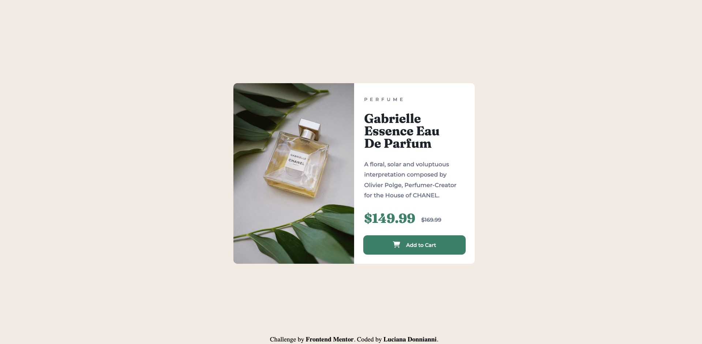

# Frontend Mentor - Product preview card component solution

This is a solution to the [Product preview card component challenge on Frontend Mentor](https://www.frontendmentor.io/challenges/product-preview-card-component-GO7UmttRfa). Frontend Mentor challenges help you improve your coding skills by building realistic projects. 

## Table of contents

- [Overview](#overview)
  - [The challenge](#the-challenge)
  - [Screenshot](#screenshot)
  - [Links](#links)
- [My process](#my-process)
  - [Built with](#built-with)
  - [What I learned](#what-i-learned)
  - [Continued development](#continued-development)
  - [Useful resources](#useful-resources)
- [Author](#author)
- [Acknowledgments](#acknowledgments)

**Note: Delete this note and update the table of contents based on what sections you keep.**

## Overview

### The challenge

Users should be able to:

- View the optimal layout depending on their device's screen size
- See hover and focus states for interactive elements

### Screenshot




### Links

- Solution URL: [https://github.com/ldonnianni/product-preview-card-component](https://github.com/ldonnianni/product-preview-card-component)
- Live Site URL: [https://ldonnianni.github.io/product-preview-card-component/](https://ldonnianni.github.io/product-preview-card-component/)

## My process

### Built with

- Semantic HTML5 markup
- CSS custom properties
- Flexbox
- SCSS
- Mobile first


### What I learned

I learned how to use media queries in order to make a design for desktop and the other one for mobile. In my first challenge I didn't quite understood it, now I have a better understanding.

```css
@media (max-width: 500px) {

    img {
        width: 350px;
        border-radius: 10px 10px 0 0px;
    }
 
}
```

I learned how to put 2 images in HTML and use a media query to choose the correct picture depending the device

```html
     <picture class="product-image">
              <source media="(min-width: 500px)" srcset="
            images/image-product-desktop.jpg">

            <source srcset="
            images/image-product-mobile.jpg">

            
        </picture>
```

I learned to code in CSS with SCSS. (sass.). In combination with the BEM naming convention, makes it easier and cleaner.


### Continued development

I would like to keep learning about Sass and Bem naming convntions. It was my first project, I need to keep practicing.


### Useful resources

- [CSS Media Queries](https://www.youtube.com/watch?v=aook54SsfhY&ab_channel=freeCodeCamp.org) - I watched this video to have a better understanding of the media quearia funcitionality and it help me in building a Responsibe Website.
- [How to insert images Using HTML and CSS](https://www.youtube.com/watch?v=_w6N_nplmAw&ab_channel=DaniKrossing) - It is a very helpful and short video on how to insert images for begginers.
- [Must know methods to master Responsive Images in HTML and CSS](https://www.youtube.com/watch?v=6EJVYwichvs&t=1355s&ab_channel=CodeLab) - With this video I could undertood how to correctly code in HTML wich image should use according to the situation. (in this case I needed one image for the desktop desgin and another to the mobile one)
- [Sass Tutorial for Beginners](https://www.youtube.com/watch?v=_a5j7KoflTs&t=1548s&ab_channel=freeCodeCamp.org) - I first approach on learning Sass. very complete tutorial, with a exercise to follow while making a portfolio.
- [The Block Element Modifier (BEM) Naming Convention Methodolgy](https://www.youtube.com/watch?v=u-XKw585KqY&t=121s&ab_channel=dcode) - 20 min on how to apply this naming convention.


## Author

- Frontend Mentor - [@ldonnianni](https://www.frontendmentor.io/profile/ldonnianni)


**Note: Delete this note and edit this section's content as necessary. If you completed this challenge by yourself, feel free to delete this section entirely.**
